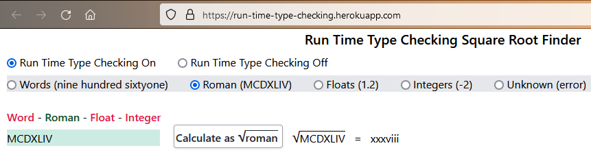

The Run-Time-Type-Checking-Example web page, [https://type-czech-always-on.onrender.com/](https://type-czech-always-on.onrender.com/) a free slow to start [vite-plugin-ssr](https://vite-plugin-ssr.com/) project, exists to highlight the use of the
[Type-Czech Javascript library](https://github.com/steenhansen/type-czech)
which provides run time type checking in Node.js and the browser. Note slow start up time as on free Heroku dyno. It finds the square roots of differing types of numbers with a type checked Javascript async fetch call.

There is only one function that is type checked in this program, async serverGetSqrt(), which fetches a
square root from the server. Both parameters and results are inspected for
correctness when Type-Czech is turned on. When Type-Czech is turned off, then there is no discernible effect.

The code to link-up the async serverGetSqrt() function to the type checking functions is:

`serverGetSqrt = type_czech.linkUp(serverGetSqrt, PRE_serverGetSqrt, POST_serverGetSqrt); `

`async function serverGetSqrt(number_style, to_square_root) { ... }`

Where PRE_serverGetSqrt() is the function that checks parameters before the actual serverGetSqrt() function is called. While the POST_serverGetSqrt() function executes after the actual function is called to
analyze the returned result value for any issues.

The two PRE and POST type-checking functions reside in [/Type-Czech/type-checks_HAS-CZECH.js](/Type-Czech/type-checks_HAS-CZECH.js).

## PRE_serverGetSqrt()

Checks that the parameters for serverGetSqrt(), number_style and to_square_root

- are two strings, no more, no less
- the first parameter, number_style, must be one of Word/Roman/Float/Integer
- the second paramter, to_square_root, must be
  - a word like 'nine hundred sixtyone' if the type of number is 'Word'
  - a Roman numeral like 'MCDXLIV' if the type of number is 'Roman'
  - a float like '1.2' if the type of number is 'Float'
  - an integer like '-2' if the type of number is 'Integer'

## POST_serverGetSqrt()

- checks that the server actually responds with a value to the fetch() call within 3 seconds
- verifies that the type of number returned is the same, for example the square root of 'four' is 'two'
- console.logs error messages like "Error -'xyz' is not a valid roman number"

## Install

- npm install

## Running program

- Localhost Dev, with Type-Czech on
  - npm run dev-has-czech

 

- Localhost Dev, with Type-Czech off
  - npm run dev-without-czech

 

- Localhost Prod, with Type-Czech on
  - npm run prod-has-czech
  - http://localhost:3000/

 

- Localhost Prod, with Type-Czech off
  - npm run prod-without-czech
  - http://localhost:3000/

## Free Hosting on render.com
	Web Service
	
	Settings
		Build Command	$ yarn
		Start Command	$ yarn start